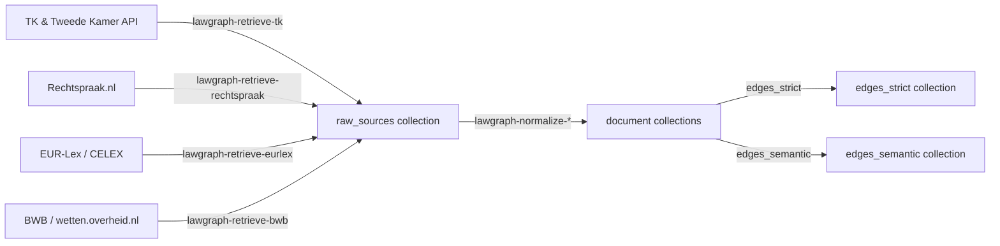
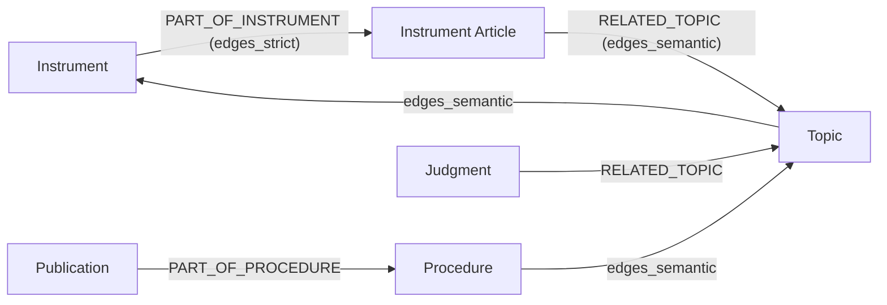

# Lawgraph  

Lawgraph bouwt een NL/EU-wetgeving en rechtspraak knowledge graph in **ArangoDB**.  
De pipelines halen data uit Tweede Kamer, Rechtspraak.nl, EUR-Lex en wetten.overheid.nl (BWB), normaliseren die tot instrument-, uitspraak- en topic-knopen en voeren ze in via deterministische `_key`s in document- en edgecollecties. Het doel is een aggregator/back-end; een UI of explorer verschijnt later bovenop de gepopuleerde graph.

## Functionaliteiten

- **Bronsupport**: retrieve-pipelines praten met de Tweede Kamer OData-API, Rechtspraak-index (met vervolgcontent), EUR-Lex/CELEX en wetten.overheid.nl (regelingen + toestanden).  
- **Retrieve-laag**: elke `lawgraph-retrieve-*` CLI vult `raw_sources` met ruwe payloads en metadata. Filters, profielen en query parameters leven in `src/config/*.yml`, niet in de pipelinecode.  
- **Normalize-laag**: `lawgraph-normalize-*`-pipelines halen relevante `raw_sources` op, mappen records naar geklasseerde `Node`-objecten (instrumenten, instrumentartikelen, procedures, publicaties, uitspraken, topics) en bouwen edges (`edges_strict`/`edges_semantic`).  
- **Profielen**: bijvoorbeeld `strafrecht` (in `src/config/strafrecht.yml`) bepaalt BWB-IDs, CELEX-lijsten, Rechtspraak-filters en topic-metadata. Deze profielen worden door CLI’s ingeladen via `LAWGRAPH_PROFILE` of `--profile`.
- **Seed CLI**: `lawgraph-strafrecht-seed` kan profielen en hun startdata in de graph injecteren; handig bij een nieuwe database of voor specifiek domeinwerk.

## Architectuur-overzicht

De kernopzet is simpel: externe bronnen → retrieve → `raw_sources` → normalize → graph. Retrieve-pipelines gebruiken `clients` uit `lawgraph.clients.*`, schrijven sessies weg via `ArangoStore.insert_raw_source` en documenteren bron/kind. Normalize-pipelines gebruiken `lawgraph.models` (met `Node`/`NodeType`, `make_node_key`) en `ArangoStore.insert_or_update` om deterministic `_key`s te bewaren. De graph bestaat uit de documentcollections `instruments`, `instrument_articles`, `procedures`, `publications`, `judgments`, `topics` en de edgecollections `edges_strict`, `edges_semantic`.



Eerst vullen retrieve-pipelines `raw_sources`, daarna transformeren normalize-pipelines data naar nodes en edges. De tweede mermaid verduidelijkt de graph-structuur.



## Installatie

1. Vereisten: Python **3.11+**, een ArangoDB 3.x/4.x instance (`docker-compose up -d arangodb` wordt meegeleverd) en optioneel Docker om de database lokaal te draaien.  
2. Clone de repository en maak een virtuele omgeving:

   ```bash
   git clone https://example.com/lawgraph.git
   cd lawgraph
   python -m venv .venv
   source .venv/bin/activate
   pip install -e ".[dev]"
   ```

3. Zorg dat `.env` de Arango-config en API-bases bevat (zie configuratie).

## Configuratie

- Maak een `.env` in de projectroot. Minimaal:

  ```env
  ARANGO_URL=http://localhost:8529
  ARANGO_DB_NAME=lawgraph
  ARANGO_USER=root
  ARANGO_PASSWORD=changeme
  ```

- Optionele base URLs / profielen:

  ```env
  TK_API_BASE=https://gegevensmagazijn.tweedekamer.nl/OData/v4/2.0/
  RECHTSPRAAK_BASE=https://data.rechtspraak.nl/
  EURLEX_BASE=https://eur-lex.europa.eu/
  BWB_BASE=https://wetten.overheid.nl/
  BWB_SRU_ENDPOINT=https://zoekservice.overheid.nl/sru/Search
  LAWGRAPH_PROFILE=strafrecht
  LAWGRAPH_SEMANTIC_EDGE_COLLECTION=edges_semantic
  LAWGRAPH_RELATION_MENTIONS_ARTICLE=MENTIONS_ARTICLE
  ```

- Document- en edgecollecties zijn configureerbaar via `LAWGRAPH_DOCUMENT_COLLECTIONS` en `LAWGRAPH_EDGE_COLLECTIONS`, zodat extra collecties gecreëerd kunnen worden zonder codewijziging.
- Profielen leven in `src/config/*.yml`. Het `strafrecht`-profiel bevat topicdefinities, `nl_instruments` met BWB-IDs, EU-instrumenten, filters (`rechtspraak`, `tk`, `eurlex`) en seed-ECLI/CELEX-lijsten. CLI’s accepteren `--profile` of lezen `LAWGRAPH_PROFILE`; `lawgraph.config.settings` en `src/config/config.py` regelen het inladen.

## Gebruik (CLI)

1. Kies een profiel (bijv. `LAWGRAPH_PROFILE=strafrecht`). Je kunt ook `--profile strafrecht` meegeven aan individuele commands.  
2. Run retrieve-commando’s:

   ```bash
   lawgraph-retrieve-tk
   lawgraph-retrieve-rechtspraak
   lawgraph-retrieve-eurlex
   lawgraph-retrieve-bwb
   lawgraph-retrieve-all
   ```

3. Normaliseer:

   ```bash
   lawgraph-normalize-tk
   lawgraph-normalize-rechtspraak
   lawgraph-normalize-eurlex
   lawgraph-normalize-bwb
   lawgraph-normalize-all
   ```

4. Seed (indien gewenste domeinstatus):

   ```bash
   lawgraph-strafrecht-seed
   ```

De retrieve-commando’s vullen `raw_sources` met payloads en `src/lawgraph/config/settings.py` bewaakt bron/kinds. Normalisatie produceert instrument-, artikel-, procedure-, publicatie- en topic-documenten met deterministic `_key`s (via `make_node_key`) en upserts (`ArangoStore.insert_or_update`). Edgecollecties `edges_strict` en `edges_semantic` verschillen in intent: de eerste bevat expliciete relationele paden (`PART_OF_*`), de tweede koppelt semantische verbanden (`RELATED_TOPIC`, inference) die straks NLP/labeling kunnen uitbreiden.

Na een volledige run zie je in ArangoDB: instrumenten uit BWB en EU, artikelen met `PART_OF_INSTRUMENT`, publicaties/judgments gekoppeld aan topics en procedures via de edgecollecties. Topics worden aangekleed met metadata en tags uit profielen.

## Ontwikkeling

- Tests: `pytest tests/`. Gebruik `ALLOW_NETWORK_TESTS=1 pytest tests/` als je echte API-calls wilt toestaan.  
- Linting: `ruff check src tests`.  
- Logging en retries zijn centraal geconfigureerd in `lawgraph.logging`.

## Licentie

Lawgraph is MIT-gegeven (zie `LICENSE`). Gebruik en hergebruik zijn toegestaan onder die voorwaarden.

## Voorlopige ontwerpbeslissingen

1. **Geen harde constants**: API-bases, collectionnamen en filters leven in `.env` en in `src/config/*.yml`, zodat profielen en deployment-instellingen niet in de business logic zitten.  
2. **Deterministische `_key`s en upserts**: `lawgraph.models.make_node_key` en `ArangoStore.insert_or_update` garanderen identieke records bij meerdere runs (idem voor edges).  
3. **Edges: strict vs semantic**: `edges_strict` bevat expliciete, reproduceerbare relaties zoals `PART_OF_INSTRUMENT`, `PART_OF_PROCEDURE`. `edges_semantic` mag later signalen bevatten zoals `RELATED_TOPIC` of NLP/label-links die niet tot dezelfde paden hoeven te leiden.  
4. **Aggregator/back-end**: dit project voert pipelines uit en bewaakt de graph. Een UI/explorer zal later via AQL of GraphQL bovenop deze gegevens verstaanbaar worden gemaakt.
