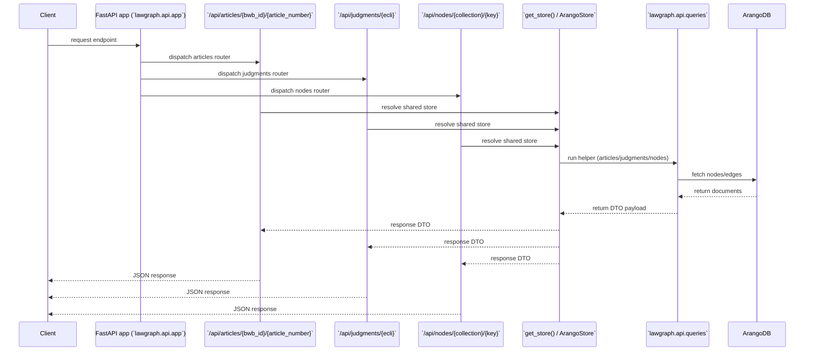

# API-laag

## Doel

Deze pagina beschrijft hoe de FastAPI-service is opgebouwd, welke endpoints er beschikbaar zijn en hoe de domainlogica vanuit `lawgraph.api.queries` uit de database wordt opgebouwd. De tekst is bedoeld voor engineers die de API willen oproepen, debuggen of uitbreiden.

## Structuur

- **Applicatie**: `lawgraph.api.app` bestaat uit een `FastAPI`-instantie die routers voor artikelen, arresten en knooppunten registreert en een eenvoudige servicebeschrijving op `/` aanbiedt.
- **Routers**: `articles`, `judgments` en `nodes` leven onder `src/lawgraph/api/routes`. Elke router gebruikt `Depends(get_store)` om een gedeelde `ArangoStore` te hergebruiken en roept queryhelpers aan om gegevens op te halen en te transformeren naar DTO's.
- **Schemas**: `src/lawgraph/api/schemas.py` definieert de view-modellen (DTO's). Ze saneren Arango-documenten, verbergen bijvoorbeeld raw XML, en voegen identifiers en metadata toe zodat de JSON-responses direct bruikbaar zijn voor topic- of UI-clients.
- **Queries**: `lawgraph.api.queries` bevat helperfuncties (`get_article_with_relations`, `get_judgment_with_relations`, `get_node_with_neighbors`) die de juiste edges doorzoeken, relaties verzamelen en metadata (zoals `judgment_count`) aan het response-model toevoegen.

## Datastromen

De volgende diagram laat zien hoe een oproep naar één van de endpoints door de lagen heen verwerkt wordt:

### Endpoint-overzicht

- **`/api/articles/{bwb_id}/{article_number}`**  
  Stuurt `ArticleDetailResponse` terug met het artikel, optioneel de parent-instrument node en alle actuele arresten die het artikel noemen.
- **`/api/judgments/{ecli}`**  
  Levert `JudgmentDetailResponse` met de arresten, alle gelinkte artikelen en metadata over het aantal gevonden relaties.
- **`/api/nodes/{collection}/{key}`**  
  Retourneert een `NodeGraphResponse` met de gevraagde node en zijn strikte/semantische buren. Alleen collecties in `_ALLOWED_NODE_COLLECTIONS` zijn toegestaan.

## Schema's en sanitatie

- **`BaseNodeDTO`** & `NeighborDTO`: gebruiken `_build_node_payload` om `_id`, `_key`, `labels` en `props` (zonder `raw_xml`) te verzamelen. `InstrumentDTO`, `ArticleDTO` en `JudgmentDTO` bouwen hierop voort.
- **Metadata**: `ArticleDetailResponse` en `JudgmentDetailResponse` voegen `metadata` toe, bijvoorbeeld `judgment_count` of `article_count`, zodat clients geen extra queries hoeven te doen voor eenvoudige tellingen.
- **Relational mapping**: `ArticleRelationDTO` combineert een artikel met zijn parent-instrument en exposeert labels/identifiers voor direct gebruik door een front-end.

## Monitoring

- **Logging**: routers gebruiken `lawgraph.logging.get_logger` en loggen 404/400 fouten.
