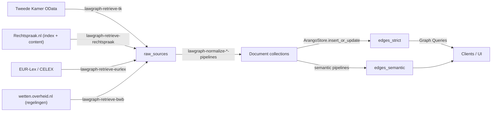

# Architectuuroverzicht

## Doel
Deze pagina beschrijft het overzicht van de Lawgraph-pijplijnen die wetgeving en rechtspraak tot een ArangoDB knowledge graph transformeren. De tekst is gericht op engineers die de dataflow willen begrijpen, nieuwe bronnen willen aansluiten of de deployment willen onderhouden.

## Belangrijkste componenten

- **Retrieve-pijplijnen (TK, Rechtspraak, EUR-Lex, BWB)**
  Klanten (`lawgraph.clients.*`) spreken externe API’s aan en leveren ruwe payloads aan `ArangoStore.insert_raw_source`. Elke pipeline implementeert `RetrievePipelineBase`, definieert domainspecifieke filters vanuit profielen en schrijft `raw_sources` met metadata (bron, kind, timestamp).
- **Normalize-laag**
  Het normaliseren gebeurt in `lawgraph.pipelines.normalize.*`. Deze pijplijnen lezen `raw_sources`, mappen payloads naar `Node`-objecten (`instrumenten`, `instrument_articles`, `procedures`, `publications`, `judgments`, `topics`) en gebruiken deterministische `_key`s via `make_node_key`. Edgecreatie (`PART_OF_*`, `RELATED_TOPIC`) gebeurt met `ArangoStore.insert_or_update` zodat meerdere runs idempotent zijn.
- **Semantic linkage pipelines**
  De TK-, EU- en Rechtspraak-semanticpipelines detecteren verwijzingen in teksten en leggen `MENTIONS_ARTICLE`-edges in `edges_semantic`. Ze laden domeinprofielen (`config/*.yml`) voor aliasgegevens en delen utilitaires zoals `lawgraph.utils.time.describe_since`.
- **Configuratie & profielen**
  `lawgraph.config.settings` centraliseert collection-, edge- en relationnamen en leest `.env`-variables. Domeinspecifieke profielen (bijvoorbeeld `src/config/strafrecht.yml`) bepalen code aliasen, instrumentlijsten, filters en seedwaarden. CLI’s (onder `lawgraph.cli`) bieden `--profile` of `LAWGRAPH_PROFILE` voor selectie.
- **ArangoDB & helpers**
  De `ArangoStore`-wrapper houdt de DB-verbinding en biedt helpers voor `insert_raw_source`, `insert_or_update` (nodes/edges) en `query`. `lawgraph.models` bevat `Node`, `NodeType` en helpers voor display-namen, terwijl `lawgraph.utils.display` en nieuwe helpers (`lawgraph.utils.time`) gedeelde logica bevatten.

## Datastromen en interfaces

Het datastromenmodel begint bij externe systemen en eindigt in twee edgecollecties (`edges_strict`, `edges_semantic`):

De normalize-laag genereert nodecollecties (`instruments`, `instrument_articles`, `procedures`, `publications`, `judgments`, `topics`). `SemanticEdges` ontstaat uit analyzeresultaten van TK-, EU- en Rechtspraakpipelines die beide instrumenten en artikelreferenties verbinden. De CLI’s orchestreren retrieve → normalize → semantic runs in opeenvolgende stappen, waarbij `LAWGRAPH_PROFILE` bepaalt welke filters en instrumenten gebruikt worden.

## Deployments en omgevingen

- **Development**: lokaal met `.env` die Arango-, API- en edgeconfig definieert. Een ingebouwde `docker-compose.yml` start een ArangoDB-instantie (`lawgraph` database). Developers gebruiken `pip install -e ".[dev]"`, `ruff check src tests`, `pytest tests`.
- **Staging/productie**: dezelfde pijplijnen draaien maar met productie-.env voor Arango (`ARANGO_URL`, credentials) en grotere profielen. Edge- en documentcollecties kunnen via `LAWGRAPH_DOCUMENT_COLLECTIONS` en `LAWGRAPH_EDGE_COLLECTIONS` worden aangepast.
- **Release-aanpak**: pipelines zijn idempotent; je kunt `lawgraph-retrieve-*`, `lawgraph-normalize-*`, `lawgraph-semantic-*` in willekeurige volgorde draaien zolang dependencies (raw → normalized → semantic) worden gerespecteerd. Seeds (`lawgraph-strafrecht-seed`) laden profielen in de graph. Logging (via `lawgraph.logging.get_logger`) rapporteert start/einde met counts en `describe_since` helpt bij debuggen.

## Randvoorwaarden en afhankelijkheden

- **Externe services**: TK OData, Rechtspraak-index, EUR-Lex/CELEX, wetten.overheid.nl (incl. SRU endpoint). De pipelines moeten omgaan met timeouts, retries en gewijzigde API-contracten.
- **ArangoDB**: vereist voor `raw_sources`, document- en edgecollecties. De `ArangoStore` houdt connecties en AQL-queries; credentials komen uit `.env`.
- **Beveiliging**: secrets (Arango-wachtwoord, API-keys) staan in `.env` en worden nooit in code gebakken. Logging moet gevoelige data vermijden.
- **Performantie**: retrieve/normalize/semantic pipelines zijn batch-georiënteerd; ze gebruiken deterministische `_key`s om redundantie te vermijden en `insert_or_update` om raceconditions in te dammen.
- **Configuratie**: alle harde constants voor URLs, BWB/CELEX IDs, filters en edge/relationnamen leven in `.env`, profile-yml’s of `lawgraph.config.settings`; de code mag geen losse strings bevatten.
