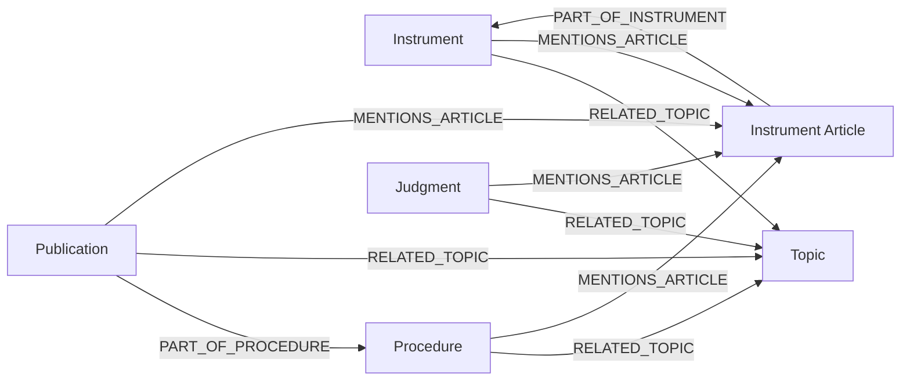

# Graafmodel

## Inleiding
Lawgraph modelleert wetgeving en rechtspraak als een gerichte graaf zodat relaties tussen instrumenten, artikelen, procedures en uitspraken eenduidig doorzoekbaar zijn. De beschrijving richt zich op ontwikkelaars die queries willen schrijven, extra bronnen willen koppelen of nieuwe edges (zoals `MENTIONS_ARTICLE`) willen toevoegen.

## Entiteiten

- **Instrument** (`Collection instruments`)  
  Een wet/instrument (BWB, EU-regel, richtlijn, etc.). Belangrijke eigenschappen: `bwb_id`, `celex`, `title`, `jurisdiction`, `labels`, `topics`, `display_name`. Relaties: `PART_OF_INSTRUMENT` (→ artikelen), `RELATED_TOPIC` (→ topics), `MENTIONS_ARTICLE` (via semantic pipelines).
- **Instrument Article** (`Collection instrument_articles`)  
  Een artikel/gepubliceerde paragraaf binnen een instrument. Props: `article_number`, `bwb_id`, `title`, `sections`, `display_name`. Verbindt met het bovenliggende instrument via `PART_OF_INSTRUMENT`. Kan ook door semantic pipelines rechtstreeks worden genoemd door procedures/publicaties/uitspraken.
- **Procedure** (`Collection procedures`)  
  Tweede Kamerprocedure (bijv. wetsvoorstel). Props: `procedure_id`, `title`, `status`, `topic`, `labels`, `text`, `display_name`. Relaties: `PART_OF_PROCEDURE` (→ publicaties), `RECT` edges (niet direct, maar topic-led).
- **Publicatie** (`Collection publications`)  
  Documenten zoals Kamerstukken. Eigenschappen: `document_number`, `title`, `body`, `labels`. Linkt naar procedures via `PART_OF_PROCEDURE` en naar artikelen via `MENTIONS_ARTICLE` (wanneer een semantische link wordt gelegd).
- **Judgment** (`Collection judgments`)  
  Rechtspraakuitspraken met `ecli`, `zaaknaam`, `raw_xml`, `labels`, `topics`. Semantic pipelines kunnen `MENTIONS_ARTICLE` edges naar instrumentartikelen toevoegen. Makkelijk verbonden met topics of andere judgments via future semantic work.
- **Topic** (`Collection topics`)  
  Domeinspecifieke onderwerpen (bijv. strafrecht). Properties: `id`, `slug`, `name`, `description`, `labels`. Wordt gelinkt aan instrumenten en procedures via `RELATED_TOPIC` en fungeert als aggregatiepunt voor filters.
- **Raw Source** (`Collection raw_sources`)  
  Niet een graph node maar een audittrail van wat retrieve-pipelines ophalen (`source`, `kind`, `external_id`, timestamps). Deze documenten worden gebruikt bij normalize/semantic om recente data te herleiden.

## Relaties en semantiek

De graaf gebruikt gestandaardiseerde edges zodat een pipeline-architectuur deterministic blijft:

- `PART_OF_INSTRUMENT`: van artikel → instrument, altijd streng (stored in `edges_strict`).  
- `PART_OF_PROCEDURE`: van publicatie → procedure, gestandaardiseerd via normalize pipelines.  
- `RELATED_TOPIC`: semantische link tussen instrument/procedure/publicatie/judgment en topics; geeft aan dat een thema centraal staat. Stored zowel in `edges_strict` (voor expliciete taxonomielinks) als `edges_semantic` (voor inferenties).  
- `MENTIONS_ARTICLE`: VARCHAR semantische edge gemaakt door TK-/EU-/Rechtspraak-pipelines wanneer een tekst een artikel of instrument citeert. Edges leven in `edges_semantic` en gebruiken deterministische `_key`s zoals `{from_key}__{to_key}__MENTIONS_ARTICLE`.

Richting: De graaf is gericht; bijvoorbeeld `InstrumentArticle -> Instrument` is `PART_OF_INSTRUMENT`. Semantic edges zijn van consumer (tekst) → article/instrument. Alle edges gebruiken `_from`, `_to`, `relation`, `source`, `confidence`, `meta`, `strict`.

## Eigenschappen en metadata

- `Node.display_name`: elk node-type heeft een `display_name` via `lawgraph.utils.display.make_display_name`, waardoor UI-queries een consistente label krijgen.  
- `Node.props`: bevat data zoals `title`, `summary`, `body`, `raw`, `ecli`, `article_number`, etc. Normalisatie en semantic pipelines moeten valideren op datatypes (strings voor identifiers, lijsten voor `labels`, dict voor `raw`).  
- `ArangoStore` bepaalt defaults (`strict` true/false) en gebruikt `insert_or_update` om `_key`-collisions te voorkomen. `_key` wordt bepaald door `make_node_key`; voor articles is dat `"{bwb_id}:{article_number}"` of similar.  
- `edge.meta`: bevat `raw_match`, `snippet`, `source`, `confidence`; hiermee kunnen consumers filters toepassen (bijv. alleen edges met `confidence >= 0.8`).

## Diagrammen en voorbeelden

Het graafmodel wordt visueel samengevat met volgende Mermaid-diagram:



Voorbeeldqueries:

1. **“Vind alle TK-publicaties die Art. 35 Sr noemen.”**  
   AQL:  
   ```aql
   FOR edge IN edges_semantic
     FILTER edge.relation == "MENTIONS_ARTICLE"
     FILTER edge._to == CONCAT("instrument_articles/", @article_key)
     RETURN edge._from
   ```
   `@article_key` is `make_node_key("BWBR0001854", "35")`.

2. **“Welke topics zijn verbonden aan EU-instrumenten die Richtlijn 2010/64/EU noemen?”**  
   AQL:  
   ```aql
   FOR instr IN instruments
     FILTER instr.celex == @celex
     FOR topic_edge IN edges_semantic
       FILTER topic_edge._from == instr._id
       FILTER topic_edge.relation == "RELATED_TOPIC"
       RETURN topic_edge._to
   ```
   `@celex` = `make_node_key("32010L0064")`.

Deze documentatie vormt een levende datadictionary die bij verdere uitbreidingen aangevuld kan worden met specifieke schemas, validaties of nieuwe semantic relations.	
