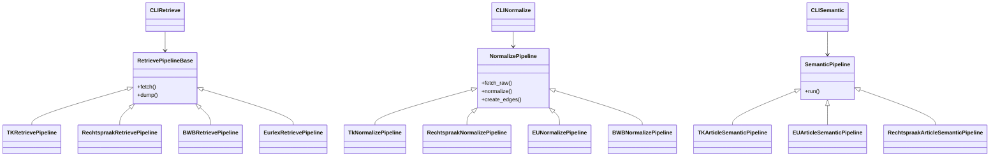

# Pijplijnen en datastromen

## Overzicht
Lawgraph is opgebouwd als een serie eenduidige pipelines die stap voor stap externe juridische bronnen transformeren naar een ArangoDB knowledge graph. Stakeholders: data-engineers die nieuwe bronnen willen aansluiten, data-analisten die graph queries uitvoeren en operators die deploys en monitoring beheren.

## Bronnen en ingestie
- **Retrieve-pijplijnen** gebruiken `lawgraph.clients.*` voor TK (OData), Rechtspraak (index + content API), EUR-Lex/CELEX, en BWB (SRU).  
- Data wordt opgehaald in batches (per ECLI, per dossier, per CELEX) en via paged HTTP-calls die `_get_json`/`_paged_get` helpers van `BaseClient` gebruiken.  
- Resultaten worden gevalideerd volgens `RetrieveRecord` (source, kind, external_id) en opgeslagen met `ArangoStore.insert_raw_source` in de `raw_sources` collectie met metadata (timestamps, filters, ECLI).  
- Domeinprofielen (bijv. `src/config/strafrecht.yml`) definiëren `filters` (search_terms, ecli_prefixes, celex_ids) die worden doorgegeven als querybindvariabelen.  

## Transformatie- en verrijkingsfasen
- **Normalize-laag** (`lawgraph.pipelines.normalize.*`): elke pipeline (TK, Rechtspraak, EUR-Lex, BWB) extendeert `NormalizePipelineBase`, leest `raw_sources`, map naar `Node`-objecten met `make_node_key`, en gebruikt `ArangoStore.insert_or_update` om deterministische `_key`s in documentcollecties (`instruments`, `instrument_articles`, etc.) en strict edges (`PART_OF_*`, `RELATED_TOPIC`) te schrijven.  
- **Semantic pipelines** (`lawgraph.pipelines.semantic.*`): analyseren tekstvelden van nodes (publications, procedures, judgments, EU documents) en detecteren artikelreferenties via regex/aliasen. Ze gebruiken `detect_*` helpers, laden profielconfiguratie voor alias-lookup, en schrijven `MENTIONS_ARTICLE`-edges in `edges_semantic` met `insert_or_update`.  
- **Shared helpers** zoals `lawgraph.utils.display` (display_name) en `lawgraph.utils.time.describe_since` zorgen voor consistente metadata in nodes/logs. Logging (via `get_logger(__name__)`) rapporteert start, finish, aantal nodes/edges verwerkt en `since` filters.

## Orkestratie en scheduling
- De CLI’s in `lawgraph.cli.*` fungeren als entrypoints (retrieve, normalize, semantic, seed). Ze accepteren `--profile` of `LAWGRAPH_PROFILE`, geven `ArangoStore` en eventueel clients/builders door en switchen pipelines per bron.  
- Orkestratie volgt een recoverable volgorde: eerst retrieve (`lawgraph-retrieve-*`), dan normalize (`lawgraph-normalize-*`), en daarna semantic (`lawgraph-semantic-*`). Operators kunnen individuele CLI’s los draaien naar behoefte.  
- Retry- en fallbacklogica: clients loggen en herhalen (via `requests` retry indien nodig). Error handling gebruikt `get_logger` en `ArangoStore` zorgt dat `insert_or_update` idempotent blijft.

## Monitoring en foutafhandeling
- Loggingniveau INFO/DEBUG geeft counts en queries, warnings signaleren ontbrekende profielen of aliasen.  
- `raw_sources` timestampvelden (`fetched_at`) maken backfills mogelijk; `describe_since` helpt bij ROI van semantic runs.  
- Fouten reproduceren: herstart retrieve/normalize met `--since`/profile filters, inspecteer `raw_sources` en her-run normalisatie zonder duplicates dankzij deterministic keys.  
- Voor productie zijn dashboards (bijv. ArangoDB metrics, pipeline logs in stdout) belangrijk; alerts kunnen gebaseerd zijn op mislukte HTTP-calls of >= 5% edge insert failures.

Deze diagram legt de erfstructuur van onze pipelineklassen vast: CLI-entrypoints (zoals `lawgraph-retrieve-*`) bouwen de juiste pipeline-instanties, retrieve-pipelines vullen `raw_sources`, normalize-pipelines transformeren naar document- en strict-edgecollecties en semantic pipelines gebruiken het `run()`-contract om `MENTIONS_ARTICLE`-edges te creëren.
